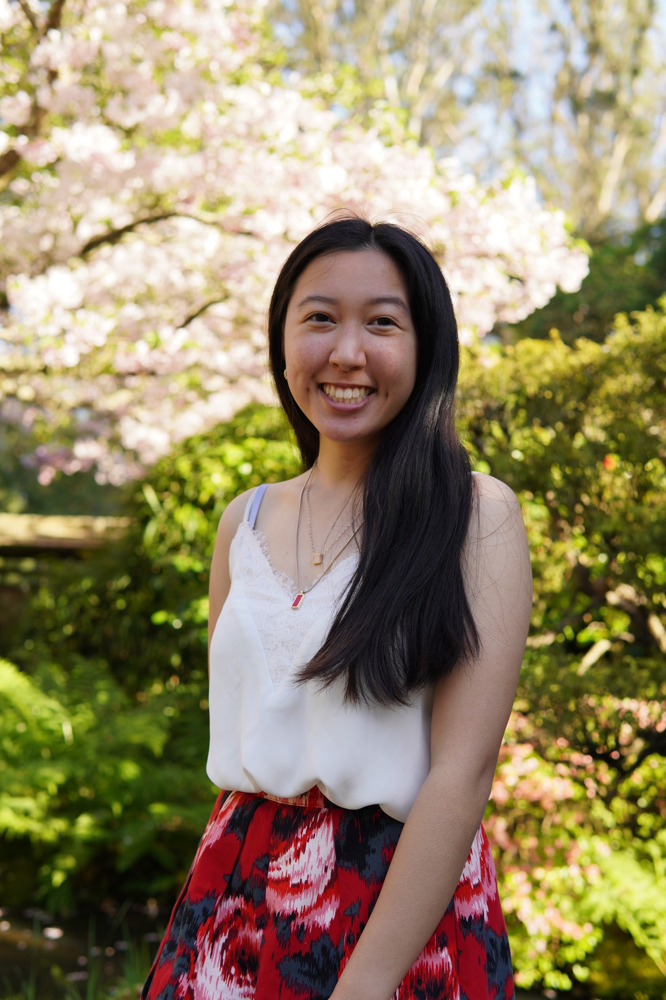

# practice-Jenna-C
# Hello! My name is Jenna Canicosa and I am from the SF Bay Area. 
# During SPIS, I am looking forward to learning python and to prepare for the upcoming school year. Since UCSD is a large school, I hope to find some new friends to 
# make the transition into college smoother.
# Some  of my favorite activities are playing Catan, spoons, Monopoly deal, and volleyball. I am always willing to be introduced to more games and activities!

